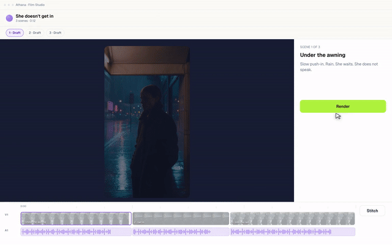

# Agentic Product Demo

**Point your coding agent at your product and get a demo video back — built in
React, not recorded off a screen.**

An agent skill and a Remotion project for product demo videos — the clips that
show what your software actually does. A muted loop for a landing section, or a
launch video that plays once for a post, a doc, an app store listing or a deck.

They are not the same film, and the agent settles which one before it starts: a
page clip autoplays, so it loops and reads with the sound off, while a launch
video plays because someone pressed play. [Sound](#5-optionally-score-it) is a
second pass over the finished file either way.

Works with Claude Code, Cursor, or anything else that loads a skill file. What
the agent does is real but not magic — it interviews you about the flow, writes
the composition, renders it and checks the result. You still answer three
questions. [What that looks like](#working-with-an-agent).



*Ten seconds out of a 42-second demo, made with this pipeline for
[Athana](https://athana.ai) — five movements, one flow, no screen recorder. The
example composition in this repo is a shorter, generic one — see
[What's in it](#whats-in-it).*

The hard part is not making a video. It is making one that does not look like
a screen recording. This repo is the motion vocabulary, the render pipeline
and the frame gate that got mine there, plus the skill file that makes an AI
agent follow them instead of improvising.

```bash
npm install
npm run studio     # preview at localhost:3000
npm run render     # renders, stitches, and gates the result
```

Node 20+. First render downloads a headless Chromium (~100 MB); if that fails
see [Troubleshooting](#troubleshooting).

---

## What's in it

| | |
| --- | --- |
| `src/motion.ts` | The vocabulary. Curves, durations, stagger, and the helpers that stop states teleporting. Imports nothing. |
| `src/title-card.tsx` | The cold open — words rising out of per-word masks. |
| `src/chrome.tsx` | The fake app window, the pointer, the click beats. |
| `src/compositions/Demo.tsx` | A worked example using every helper. Copy this, change the flow. |
| `scripts/render.sh` | Sequence render → 1536×960 mp4 + poster → gate. |
| `scripts/check-frames.mjs` | The frame gate. See below. |
| `scripts/add-sfx.sh` | Optional sound pass over the finished mp4. |
| `scripts/beats/` | One beat file per clip — where the sound is scored. |
| `.claude/skills/product-demo/` | The skill: the playbook an agent reads before touching any of it. |
| `AGENTS.md` | What an agent needs on arrival — commands, and the rules it would otherwise break. |

`AGENTS.md` at the root is read natively by Claude Code, Codex, Cursor, Aider,
Copilot, Gemini CLI and Windsurf — an agent opening this folder is oriented
before you say anything. `CLAUDE.md` points at it rather than repeating it.

Cursor users who want the skill loaded as a skill: copy
`.claude/skills/product-demo/` to `.cursor/skills/`. Same file either way.

---

## Your first clip

### The mental model

A composition is a **pure function of the frame number**. `useCurrentFrame()`
hands you N, you return what the screen looks like at frame N. Nothing is
stateful and nothing animates on its own — if a value is not derived from the
frame, it does not move.

That is why every clip starts with a **beat sheet**: a block of named
constants for the frame each thing happens on. Look at the top of
`src/compositions/Demo.tsx` — `FIELD_CLICK = 20`, `RUN_CLICK = 88`,
`TOAST_AT = 282`. Decide those before you write any JSX, because every
entrance, colour change and cursor move is anchored to one of them.

Elements are positioned in absolute pixels rather than with flexbox. A demo is
choreography: you need to know where a button *is* in order to put a pointer
on it at frame 214.

### 1. Copy the example

```bash
cp src/compositions/Demo.tsx src/compositions/MyClip.tsx
```

Rename the export `Demo` → `MyClip` and `DEMO_LEN` → `MYCLIP_LEN`.

### 2. Register it

`src/Root.tsx` currently returns a single `<Composition>`. Wrap it in a
fragment and add yours next to it:

```tsx
import { MyClip, MYCLIP_LEN } from "./compositions/MyClip";

return (
  <>
    <Composition id="demo" /* … */ />
    <Composition
      id="myclip"
      component={() => (
        <Clip body={<MyClip />} name="My Product" kicker="One line of promise" />
      )}
      durationInFrames={MYCLIP_LEN + TITLE_LEN}
      fps={FPS}
      width={WIDTH}
      height={HEIGHT}
    />
  </>
);
```

### 3. Watch it

```bash
npm run studio          # localhost:3000, pick "myclip", scrub the timeline
```

Scrubbing is where the work happens. Jump to a beat, look at it, adjust the
constant, look again.

### 4. Render it

```bash
sh scripts/render.sh myclip 300     # 300 = which frame becomes the poster
```

`npm run render` is just this with `demo`. Output lands in `out/`.

The example runs 480 frames — 16 seconds. **That is a default, not a ceiling.**

Length follows your flow rather than a template. Budget one step, add 66 for
the title and ~30 for the outro, and set `MYCLIP_LEN` to the total:

| pace | simple step | movement with its own beats |
| --- | --- | --- |
| punchy | 70 | 170 |
| standard | 100 | 240 |
| cinematic | 140 | 330 |

A three-step flow lands near 14 seconds; a five-movement product story runs
past 40. Nothing in the pipeline cares which you pick — the render, the gate
and the sound pass all read the length off the composition.

Working with an agent, you do not do this arithmetic: it derives the number
from the flow you described and shows its working, so you can answer "punchy"
in one word instead of counting frames.

### 5. Optionally, score it

```bash
bash scripts/add-sfx.sh myclip      # out/myclip-sound.mp4
```

A clip autoplaying in a page **has to stay muted** — browsers block autoplay
with audio, and a scored file simply will not start. So for a page loop the
silent mp4 is the deliverable and the scored one is an extra.

For a launch video nobody autoplays: sound can be the point, and the scored
file is the one you ship. Either way the pass writes a new file and the silent
original is never overwritten.

The pass runs over the already-rendered mp4 and copies the video stream byte
for byte (`-c:v copy`), so no frame is redrawn and the gate does not need
re-running. Beats live in `scripts/beats/<id>.txt`, written against the
beat-sheet constants at the top of your composition. Nine sounds, chosen by
level of motion rather than by element — the palette and the rules are in
`scripts/add-sfx.sh` and in the skill.

### Then make it yours

1. `src/theme.css` — swap the placeholder tokens for your product's. Nothing
   downstream hardcodes a colour.
2. `src/fonts.ts` — swap the face. A `fontFamily` string alone loads nothing;
   skip `loadFont()` and every frame silently renders in a system fallback.
3. `src/motion.ts` — replace the curves with the ones from your own
   stylesheet, so the film moves the way the product does.
4. `MyClip.tsx` — replace the flow with the real steps of your product, in the
   real order, with copy taken from the live UI. A demo that walks a flow the
   product doesn't have proves nothing, however good it looks.

---

## The eight motion rules

These are the difference between a clip that reads as software and one that
reads as a screenshot slideshow. Long form in
`.claude/skills/product-demo/references/motion.md`.

1. **A boolean in a style is a bug.** `on ? "var(--brand)" : "var(--border)"`
   snaps in one frame. Anchor a ramp at the frame the state changes and blend
   the tokens through it.
2. **Never `scale(0)`.** Entrances start at 0.9–0.97 and travel ≤16px. A 40px
   entrance reads as a slide deck.
3. **Counters count.** A number that jumps is the loudest teleport on screen,
   because the eye is already reading it.
4. **Typed text types.** Static copy in a field the flow says is being filled
   reads as a screenshot, and viewers clock it instantly.
5. **Nothing enters as a group.** Two-frame stagger, minimum.
6. **Springs for landing, ramps for travel.** Damping 14 or above, or it
   looks like a toy.
7. **Weight and layout stay stepped.** Tweening `fontSize` reflows the row
   every frame.
8. **One hero beat per phase.** If everything is animated, nothing reads as
   animated.

And the one that is not about motion: **never put a lasting `transform` on
the container that holds the whole UI.** A scale on the app frame resamples
every glyph inside it. Move what is *in* the frame, never the frame.

---

## Working with an agent

`.claude/skills/product-demo/SKILL.md` is written to be read by Claude Code,
Cursor, or anything else that loads skill files. It is not documentation with
a YAML header on top — it is a set of refusals.

### First it reads your product, then proposes a plan.

If it can reach your repo, your running app or your site, it reads them — the
running order of your marketing page tells it which features matter and in
what order, and the app tells it what those features actually look like.
Neither answers the other's question. Then it drafts the whole thing and asks
you to confirm it, rather than interviewing you for what it could have looked
up.

Four things have to be settled before a line of a composition gets written:

> **0. A demo of the whole product, or a scene about one feature?** A product
> demo strings three to five features into movements on a through-line; a
> feature clip walks one flow start to finish. They are not the same clip at
> different lengths.
>
> From that one answer it infers where the clip lives — whole product means a
> standalone launch video that plays once, one feature means a muted loop in a
> page section — and **tells you which it assumed**, because that assumption
> decides the loop seam, the sound, the length ceiling and the ending. Both
> crossings happen; correcting it costs a word.
>
> **1. What is being made on screen?** Not the feature — the thing the viewer
> watches get built. "A revenue report", "a deploy going out".
>
> **2. What does it walk, in order?** Real steps, or real features as
> movements with something carrying the viewer between them. Copy comes from
> the live product.
>
> **3. How does it end?** By default on the finished thing — the flow
> completes and the last state holds long enough to read. No asset, no
> question. Only when the ending is media your product *generates* does it
> need a real file, and there it may propose one from your disk but never
> fabricate a stand-in.

It also tells you, up front, that describing the flow yourself gets a better
clip than letting it infer one — the code does not record which path converts,
which step people get stuck on, or which feature shipped last week and needs
the attention. That is an offer, not a gate: ignore it and it reads your
product and proposes a flow anyway.

Beyond that it asks only for what is not in the artifact — what the clip is
*for*, and which payoff is the real one when several would do. Fragments are
fine as answers. Handing you a form to fill in is not.

### Then it shows you the shot list, and waits.

> ```
> t0    title     "Acme Studio" · "Ask a question, publish the answer"
> 0     query     types "Revenue by channel, last quarter", hits Run
> 96    results   five channel rows stagger in, counter lands on 2,481
> 184   filter    "Paid only" lights, the count re-counts to 312
> 274   publish   press, confirmation springs into the slot
> 380   out       folds back to the dark ground
> ```
>
> Four steps and a reveal, standard pace: 66 + 4×100 + 240 + 30 = **736
> frames, 24.5s**. Ends on the published report card. Say "punchy" for ~18s.

One line per phase, the frame it starts on, and the arithmetic behind the
length — so a redirect costs you a word instead of a paragraph.

That checkpoint is the whole reason the interview exists. The failure mode of
"make me a demo video" is a beautiful montage of output that never shows what a
visitor would actually do, and getting question 2 wrong is the one defect that
cannot be fixed in the edit — by the time you see it, the entire clip is built
on it. Correcting a line in that list costs a sentence. Correcting it after the
composition exists costs a rebuild.

Everything else it decides on its own and tells you in passing: the title copy,
the pace, and which single element carries the hero beat of each phase.

If you only take one thing from this repo, take that section.

---

## The frame gate

Every render is checked before it is allowed to pass.

`scripts/check-frames.mjs` looks for two defects. **Corrupted frames**, where
the page texture comes back wrapped or mirrored inside an otherwise correct
frame — it hits a handful out of hundreds, at random, so it reads as a flicker
rather than as damage, and no encoder setting fixes it because it is already
baked into the JPEG. And **luminance jumps**, including the loop seam: the
last frame cutting back to frame 0, which fires every time the video repeats
and which nobody inspects.

```
480 frames, 1536x960

tiled frames: none

luminance jumps over 25: none

loop seam: frame 479 Y=20.0 -> frame 0 Y=20.0   jump 0.0
```

`scripts/render.sh` exits non-zero on a failure. For a clip that plays once
rather than looping, pass `STANDALONE=1` — the seam check only means something
for a clip that cuts back to its first frame, and without the flag the gate
fails a launch video for ending somewhere brighter than it started. Remotion's docs also
recommend [`--concurrency=1`](https://www.remotion.dev/docs/flickering) for
flickering and the render script always passes it — but a flag you have to
remember is not a guarantee.

**Two known blind spots.** Both come from the same heuristic: the tile check
asks whether a frame's left half resembles its right half, which is anomalous
in a dense interface and perfectly normal elsewhere.

*Flat frames.* Nearly one colour means matching halves by definition, so only
frames with real contrast are judged (`FLAT = 120`). On a pale, low-contrast
UI it will miss corruption a dark one would catch. Lower the threshold for a
light product; never raise it to make a failure go away.

*Repeating or symmetric content.* A grid background, a striped field, a
centred layout — the halves match because the design says so. Measured
against a motion-graphics render on a grid template, this produced nine false
positives out of three hundred frames, every one of them a frame where the
foreground text had left and only the grid remained. **This detector is built
for product UI.** On graphic content, read every flag before believing it.

---

## How much of this is Remotion

`src/motion.ts` — the vocabulary, and the part worth taking — **imports
nothing at all**: the bezier solver, the clamped span and the damped
oscillator behind `pop()` are written out in the file. It works unchanged
under Framer Motion, in a canvas loop, or in React Native.

Remotion itself is five symbols in three files — `registerRoot`,
`Composition`, `Sequence`, `AbsoluteFill`, `useCurrentFrame`, plus `loadFont`.
It bundles the app, drives the frame clock, runs headless Chromium and gives
you the Studio.

---

## Troubleshooting

**`Timed out after 25000 ms while trying to connect to the browser!`**, with
an empty Chrome log. Almost never a Remotion problem.

- Remotion's bundled Chromium will not launch on older systems — on macOS it
  wants 15 (Sequoia). Point it at an installed Chrome instead:

  ```bash
  export CHROME_PATH="/Applications/Google Chrome.app/Contents/MacOS/Google Chrome"
  ```

  `remotion.config.ts` picks that up automatically.

- **If you use `CHROME_PATH`, quit Chrome first.** Launching a second instance
  of an already-running browser hands off to the existing process and exits
  without opening a debugging port. Nothing is logged, because nothing crashed.

**The clip flickers.** Run `scripts/check-frames.mjs` on the mp4 before
touching the encoder — that diagnosis is wrong twice as often as it is right.
Full debugging order in
`.claude/skills/product-demo/references/render.md`.

---

## Licensing — read this before you build on it

**This kit is MIT.** See `LICENSE`.

**Remotion is not.** Remotion is source-available under its own licence:
free for individuals, non-profits, and for-profit companies **up to 3
employees**; larger companies need a paid Company License from
[remotion.pro](https://www.remotion.pro/license). That applies to you as soon
as you `npm install`, regardless of what this repo's licence says. Check
where you land before you ship something commercial on it.

ffmpeg binaries come from `ffmpeg-static` and carry their own terms.

---

## Credits

The motion rules above are a translation of
[Emil Kowalski](https://emilkowal.ski)'s writing and animation skills into the
constraints of a rendered file. Two things do not carry over: Remotion has no
CSS transitions, and `prefers-reduced-motion` is meaningless in an mp4.
Everything else about curves, properties, durations and stagger applies
unchanged, and his material is the best thing to read alongside this.

Built with [Remotion](https://www.remotion.dev).
